# Sales Application — Project Documentation

> A web-based **Sales & Distribution Management System** for a salesperson/distributor to manage
> inventory, trucks & dispatch, customers, orders, payments, stock requests, and reports — built with
> a .NET 10 Web API backend and an Angular 22 + Material frontend.

---

## Table of Contents
1. [Overview](#1-overview)
2. [Problem Statement, Objectives & Scope](#2-problem-statement-objectives--scope)
3. [Technology Stack](#3-technology-stack)
4. [System Architecture](#4-system-architecture)
5. [Project Structure](#5-project-structure)
6. [Database Design (Domain Model)](#6-database-design-domain-model)
7. [Functional Modules](#7-functional-modules)
8. [Key Business Logic](#8-key-business-logic)
9. [REST API Reference](#9-rest-api-reference)
10. [Frontend Design](#10-frontend-design)
11. [Security](#11-security)
12. [Setup & Installation](#12-setup--installation)
13. [Configuration](#13-configuration)
14. [Default Login & Sample Data](#14-default-login--sample-data)
15. [Future Enhancements](#15-future-enhancements)
16. [Conclusion](#16-conclusion)

---

## 1. Overview

The **Sales Application** digitizes the day-to-day operations of a small distribution business that
sells goods to customers from a warehouse (godown) and delivery trucks. It replaces manual registers
and spreadsheets with a single, secure web application where each **salesperson** manages their own
catalog, stock, customers, orders, payments and reports.

The system is **multi-tenant by salesperson**: every record (category, item, customer, order, truck,
etc.) is owned by the logged-in user, so each salesperson sees and manages only their own data. It
tracks the **complete sales cycle** — from receiving stock (with purchase-price/batch history),
loading it onto trucks, taking customer orders, recording part/full payments and customer advances,
generating invoices, through to daily/monthly/yearly performance reporting.

---

## 2. Problem Statement, Objectives & Scope

### Problem Statement
Small distributors typically track inventory, customer orders, deliveries and payments on paper or in
disconnected spreadsheets. This leads to stock mismatches, untracked outstanding payments, no audit
trail of stock movement, and no quick visibility into sales performance.

### Objectives
- Provide a single application to manage **catalog, inventory, customers, orders, payments and reports**.
- Maintain **accurate stock** with automatic decrement on dispatch/order and full movement history.
- Track **outstanding balances, partial payments and customer advances** precisely.
- Support **truck-based dispatch** and order fulfilment from either godown or truck stock.
- Offer **secure, per-user** access with login, profile, and password recovery.
- Give the owner **daily/monthly/yearly and per-customer** financial insight.

### Scope
- **In scope:** authentication & profile, product catalog (categories/sub-categories/items), inventory
  with FIFO batch costing, delivery routes, trucks & truck stock, dispatch, customers, customer orders,
  payments & advances, stock requests ("My Orders"), invoices (PDF + email), and reports.
- **Out of scope (current version):** multi-role admin hierarchy, online customer self-service portal,
  payment-gateway integration, and GST/tax filing.

---

## 3. Technology Stack

| Layer | Technology |
|------|------------|
| **Backend** | ASP.NET Core **.NET 10** Web API (REST, controllers) |
| **ORM / DB** | Entity Framework Core 10 + **SQL Server** (code-first migrations) |
| **Auth** | JWT Bearer tokens; **BCrypt** password hashing |
| **Email** | **MailKit** (SMTP) for OTP & invoice email (console fallback in dev) |
| **PDF** | **QuestPDF** for invoice generation |
| **API Docs** | Swagger / OpenAPI (Swashbuckle) |
| **Frontend** | **Angular 22** (standalone components, Signals), **Angular Material** |
| **Deployment** | Docker + Docker Compose (SQL Server + API + Angular/nginx) |

---

## 4. System Architecture

A classic **3-tier** architecture:

```
┌────────────────────────┐      HTTPS/JSON (JWT)      ┌──────────────────────────┐      EF Core      ┌──────────────┐
│  Angular 22 SPA         │  ───────────────────────▶ │  .NET 10 Web API          │  ──────────────▶ │  SQL Server  │
│  (Material, Signals)    │  ◀─────────────────────── │  Controllers → Services    │  ◀────────────── │  (SalesAppDb)│
│  nginx (in Docker)      │                            │  → DbContext               │                   └──────────────┘
└────────────────────────┘                            │  JWT · BCrypt · MailKit ·  │
                                                       │  QuestPDF                  │
                                                       └──────────────────────────┘
```

- The **SPA** calls the API under `/api/**` with a `Bearer` JWT on every request (added by an HTTP
  interceptor). On `401` it logs out and redirects to login.
- The **API** validates the JWT, derives the current user id from claims (`OwnedControllerBase`), and
  scopes all queries to that user. Business rules live in **services** (`OrderMath`, `InventoryService`,
  `InvoiceService`, `EmailService`, `OtpService`, `JwtTokenService`).
- **EF Core** maps the domain model to SQL Server; migrations run automatically on startup and a
  default user is seeded.
- In **Docker**, nginx serves the built Angular app and reverse-proxies `/api` to the backend container.

---

## 5. Project Structure

```
SalesApplication/
├── backend/SalesApp.Api/         # .NET 10 Web API
│   ├── Controllers/              # Auth, Profile, Categories, SubCategories, Items, Dispatch,
│   │                             #   Customers, Routes, Trucks, Orders, Payments,
│   │                             #   StockRequests, StockRequestPayments, Reports (+ OwnedControllerBase)
│   ├── Models/                   # Entities + Enums
│   ├── Data/                     # AppDbContext, DbSeeder, migrations
│   ├── DTOs/                     # Request/response records, PagedResult<T>
│   ├── Services/                 # JwtTokenService, EmailService, OtpService, OrderMath,
│   │                             #   InventoryService, InvoiceService, Mappers, Settings
│   ├── wwwroot/uploads/profile/  # Uploaded profile images
│   ├── appsettings.json          # Connection string, JWT, SMTP
│   └── Program.cs                # DI, auth, CORS, Swagger, static files, seeding
│
├── frontend/sales-app/           # Angular 22 + Material
│   └── src/app/
│       ├── core/                 # auth.service, api.service, auth.guard, auth.interceptor, models
│       ├── shared/               # pager (client & server), confirm-dialog, directives
│       ├── layout/               # shell (sidenav + toolbar + mobile tabs)
│       └── features/             # auth, profile, dashboard, categories, inventory, dispatch,
│                                 #   customers, routes, trucks, orders, my-orders, reports
│
├── tools/populate-data.js        # Seeds ~20 sample records per section via the API
├── docker-compose.yml            # db + backend + frontend
└── docs/PROJECT_DOCUMENTATION.md # This document
```

---

## 6. Database Design (Domain Model)

All business entities carry a **`UserId`/`SalesmanId`** owner and (where applicable) an **`IsActive`**
flag for soft-delete. Money fields use `decimal(18,2)`.

### Core entities

| Entity | Key fields | Purpose |
|--------|-----------|---------|
| **AppUser** | Id, FullName, Email (unique), PasswordHash, Phone, ProfileImagePath | Salesperson / login account |
| **Category** | Id, UserId, Name, Description, IsActive | Top-level product grouping |
| **SubCategory** | Id, UserId, CategoryId→Category, Name, IsActive | Second-level grouping |
| **Item** | Id, UserId, SubCategoryId→SubCategory, Name, Sku, Unit, **StockQuantity** (godown), **DispatchStock** (on trucks), UnitPrice, IsActive | Product / inventory item |
| **DeliveryRoute** (`Routes`) | Id, UserId, Name, Description, IsActive | Delivery route; customers belong to a route |
| **Customer** | Id, UserId, Name, Phone, Email, Address, RouteId→DeliveryRoute, IsActive | Buyer |
| **Order** | Id, OrderNumber (unique), CustomerId→Customer, SalesmanId→AppUser, TruckId→Truck, OrderDate, DeliveryDate, **Status**, **PaymentStatus**, **Source**, TotalAmount, PaidAmount, RemainingAmount, Notes, IsActive | Customer sales order |
| **OrderItem** | Id, OrderId→Order, ItemId→Item, Quantity, UnitPrice, LineTotal, ReceivedStatus | Order line |
| **Payment** | Id, OrderId→Order, Amount, PaymentDate, Method, Note | Payment against an order |
| **Truck** | Id, UserId, Name (unique per user), IsActive | Delivery truck |
| **TruckStock** | Id, TruckId→Truck, ItemId→Item, Quantity (unique per truck+item) | Stock currently loaded on a truck |
| **Dispatch** | Id, UserId, DispatchDate, TruckLabel, Notes, IsActive | A truck-loading event |
| **DispatchItem** | Id, DispatchId→Dispatch, ItemId→Item, Quantity | Dispatch line |
| **DispatchDraft** | Id, UserId (unique), TruckLabel, Notes, ItemsJson | Unsaved dispatch "cart" persisted per user |

### Inventory costing & audit

| Entity | Key fields | Purpose |
|--------|-----------|---------|
| **InventoryBatch** | Id, UserId, ItemId→Item, InitialQuantity, Quantity (remaining), PurchasePrice, CreatedAt, StockRequestId | A received lot at a purchase price (enables FIFO + price history) |
| **InventoryTransaction** | Id, UserId, ItemId, BatchId, Type (In/Out), Quantity, UnitCost, TotalCost, RefType, RefId, Source, Reversed, CreatedAt | Full ledger of every stock movement |

### Stock requests ("My Orders") — the salesperson's own restock requisitions

| Entity | Key fields | Purpose |
|--------|-----------|---------|
| **StockRequest** | Id, RequestNumber (unique), SalesmanId, Status, TotalAmount, PaidAmount, RemainingAmount, PaymentStatus, Notes, IsActive | Request to restock items |
| **StockRequestItem** | Id, StockRequestId, ItemId, Quantity, UnitPrice, LineTotal | Request line |
| **StockRequestPayment** | Id, StockRequestId, Amount, PaymentDate, Method, Note | Payment against a request |

### Auth support

| Entity | Key fields | Purpose |
|--------|-----------|---------|
| **PasswordResetOtp** | Id, Email (indexed), OtpHash, ExpiresAt, IsUsed | Hashed OTP for password reset (10-min expiry) |

### Enumerations

```text
OrderStatus        : Pending(0), Dispatched(1), Delivered(2), Completed(3), Remaining(4), Cancelled(5)
PaymentStatus      : Pending(0), Advance(1), Paid(2), Partial(3)
ReceivedStatus     : Pending(0), Remaining(1), Completed(2)
OrderSource        : Inventory(0)  — from godown stock ; Dispatch(1) — from a truck's stock
StockRequestStatus : Pending(0), Fulfilled(1), Cancelled(2), Done(3)
InventoryTxnType   : In(0), Out(1)
```

---

## 7. Functional Modules

| Module | Description |
|--------|-------------|
| **Authentication** | Register, login (JWT), forgot-password → **email OTP** → reset, change password. |
| **Profile** | View/update profile, **editable email**, **profile-image upload**. |
| **Dashboard** | KPI cards: total customers, items (with low-stock count), orders (with pending count), total sales & outstanding. |
| **Categories / Sub-categories** | Dual-pane CRUD with search, active/inactive filter, soft-delete + reactivate. |
| **Inventory (Items)** | CRUD with stock & unit price; low-stock filter; **purchase-price history** (per batch) and **stock-movement ledger** (in/out audit). |
| **Routes** | Delivery routes; customers are assigned to a route. |
| **Trucks** | Managed trucks, each with its own per-item stock. |
| **Dispatch (Truck)** | Load godown stock onto trucks; persisted **draft cart**; validates & decrements stock; per-day/per-truck consolidation; edit/deactivate reverses stock. |
| **Customers** | CRUD + route assignment; **search** and a **360° detail view** (totals, advance, pending vs delivered, every order with items). |
| **Customer Orders** | Manual order entry from **Inventory or Dispatch (truck)** source; rich **filters**; status & delivery-date updates; per-line received status; **cancel** (returns stock, paid → advance); **invoice download/email**. |
| **Payments** | Record payments, settle balance, **apply customer advance**; paid/remaining/status auto-recompute. |
| **My Orders (Stock Requests)** | Salesperson restock requisitions with their own payment ledger; **fulfill** (adds to inventory), mark done, cancel. |
| **Reports** | **Daily / Monthly / Yearly** sales breakdowns + **per-customer** pending vs delivered & outstanding. |
| **UX** | Server-side pagination (5/page; 5/10/25/50), Sr.No columns, Material `fill` form fields with validation, password show/hide, responsive layout with mobile bottom-tabs. |

---

## 8. Key Business Logic

- **Per-user ownership** — `OwnedControllerBase.CurrentUserId` (from the JWT) scopes every query; cross-user access returns 403.
- **Soft delete** — destructive actions set `IsActive = false` and can be reactivated; items can't be deleted while referenced by orders/dispatches/etc.
- **FIFO inventory costing** — receiving stock creates an **InventoryBatch** at its purchase price; consumption (orders/dispatch) draws from the **oldest batch first**, recording an **InventoryTransaction** per movement. This powers cost-of-goods, average cost, stock value and full reversibility.
- **Two stock buckets** — `Item.StockQuantity` (godown) and `TruckStock` (per truck). An order's `Source` decides which bucket it consumes; dispatch moves stock godown → truck.
- **Order lifecycle** — create → (status transitions) → cancel. Editing reverses old stock effects then reapplies; cancelling returns stock and turns any paid amount into **customer advance**.
- **Payments & advances** — `OrderMath.Recalculate` recomputes `PaidAmount`/`RemainingAmount`/`PaymentStatus` after every change. Overpayment becomes a **customer advance** that can be applied to other orders of the same customer.
- **Auto numbering** — orders use `ORD-YYYY-MM-NNNNN` (monthly sequence); stock requests get their own `RequestNumber`.
- **Invoices** — QuestPDF renders an itemized PDF per order, downloadable or emailed to the customer.

---

## 9. REST API Reference

Base: `/api`. All endpoints require a `Bearer` JWT **except** `auth/*`. List endpoints support
server-side pagination (`page`, `pageSize`) and return `PagedResult<T> { items, total, page, pageSize }`.

| Controller | Representative endpoints |
|-----------|--------------------------|
| **auth** | `POST register`, `POST login`, `POST forgot-password`, `POST verify-otp`, `POST reset-password` |
| **profile** | `GET me`, `PUT /`, `POST upload-image`, `POST change-password` |
| **categories** / **subcategories** | `GET /` (search, active, page), `GET {id}`, `POST /`, `PUT {id}`, `DELETE {id}` (soft), `PUT {id}/activate` |
| **items** | CRUD + `GET {id}/price-history`, `GET {id}/movements` (inventory ledger); list filters: `subCategoryId, lowStock, threshold, category, item, sku, active` |
| **routes** | CRUD + `activate` |
| **trucks** | CRUD + `GET {id}/stock` |
| **dispatch** | `GET /` (truck/date/active), `GET /trucks`, `POST /` (validates + decrements, merges per truck/day), `PUT {id}`, `DELETE {id}` (reverses stock), `PUT {id}/activate`, `GET/PUT/DELETE /draft` |
| **customers** | CRUD + `GET {id}/details`, `GET /search?query=`, `GET {id}/advance` |
| **orders** | CRUD, `GET {id}/items`, `PUT {id}/status`, `PUT {id}/delivery-date`, `PUT {id}/items/{itemId}/received-status`, `PUT {id}/cancel`, `PUT {id}/activate`, `GET {id}/invoice`, `POST {id}/invoice/email`; list filters: `orderNumber, customer, orderDate, status, paymentStatus, mine, active` |
| **payments** | `GET by-order/{orderId}`, `POST /`, `POST settle/{orderId}`, `POST apply-advance/{orderId}`, `DELETE {id}` |
| **stock-requests** | CRUD + `PUT {id}/fulfill`, `PUT {id}/done`, `PUT {id}/cancel`, `PUT {id}/activate` |
| **stock-request-payments** | `GET by-request/{id}`, `POST /`, `POST settle/{id}`, `POST apply-advance/{id}`, `DELETE {id}`, `GET advance` |
| **reports** | `GET monthly?year=&month=`, `GET daily?year=&month=`, `GET yearly?year=`, `GET by-customer` |

> Full request/response shapes are visible in **Swagger** at `http://localhost:5219/swagger` while the API runs.

---

## 10. Frontend Design

- **Standalone components + Signals** throughout; all feature routes are **lazy-loaded** behind an `authGuard`.
- **Routes:** public — `/login`, `/register`, `/forgot-password`, `/reset-password`; guarded (inside the shell) — `/dashboard`, `/categories`, `/inventory`, `/dispatch`, `/trucks`, `/customers`, `/routes`, `/orders`, `/my-orders`, `/reports`, `/profile`, `/change-password`.
- **Core services:** `AuthService` (JWT in `localStorage`, current-user signal), `AuthInterceptor` (attaches token, handles 401/network errors via snackbars), `AuthGuard`, and a typed `ApiService` wrapping every endpoint.
- **Shared:** `createServerPager` (server-side paging used by all master tables, default 5/page, options 5/10/25/50), `createPager` (client-side), a reusable `ConfirmDialog`, and input directives (date, digits-only).
- **Layout:** Material sidenav + toolbar (profile menu/logout) on desktop; a bottom-tab bar on mobile (`max-width: 768px`).
- **UX patterns:** reactive-form validation with inline errors and required markers, password show/hide toggles, searchable dropdowns, debounced draft saving (dispatch), stock-availability validation, Sr.No columns, and snackbar notifications.

---

## 11. Security

- **JWT bearer auth** (HMAC-SHA256), token expiry configurable (default 8 hours); claims carry the user id used for ownership scoping.
- **BCrypt** password hashing; OTPs are **hashed** and expire in 10 minutes.
- **Per-user data isolation** enforced server-side on every controller.
- **CORS** restricted to the Angular origin in development.
- Profile-image uploads validated by type and size (≤ 5 MB).
- **Note for production:** change `Jwt:Key` to a long random secret and keep SMTP/DB credentials out of source control (use environment variables / user-secrets).

---

## 12. Setup & Installation

### Prerequisites
- .NET SDK 10, Node.js 20+, Angular CLI 22, SQL Server (local), EF Core tools (`dotnet tool install --global dotnet-ef`).

### Option A — Run locally
```bash
# Backend
cd backend/SalesApp.Api
dotnet run                       # http://localhost:5219  (Swagger at /swagger)

# Frontend (new terminal)
cd frontend/sales-app
npm install
ng serve                         # http://localhost:4200
```
On first run the API applies EF migrations and seeds the default user automatically.

### Option B — Run with Docker
```bash
docker compose up --build
```
Brings up SQL Server + the API + the Angular app (nginx). The app is served on the mapped web port and
nginx proxies `/api` to the backend.

---

## 13. Configuration

`backend/SalesApp.Api/appsettings.json`:
- **ConnectionStrings:DefaultConnection** → SQL Server (`SalesAppDb`).
- **Jwt** → `Issuer`, `Audience`, `Key`, `ExpiryMinutes` (default 480).
- **Smtp** → `Host`, `Port`, `UseSsl`, `User`, `Password`, `FromName`, `FromEmail`. If left blank, OTPs
  are written to the server console (dev fallback); fill it in to send real OTP/invoice emails.

`frontend/sales-app/src/environments/environment.ts`:
- **apiBaseUrl** → `http://localhost:5219/api` (the backend API base).

---

## 14. Default Login & Sample Data

**Seeded account**

| Email | Password |
|-------|----------|
| `sales@salesapp.com` | `Sales@123` |

(Email and password are editable in-app; the email is the login username.)

**Sample data** — with the API running:
```bash
node tools/populate-data.js
```
Populates ~20 records per section (categories, sub-categories, items, customers, orders with varied
statuses/payments, and dispatches) through the API.

---

## 15. Future Enhancements
- Role-based access (admin/manager over multiple salespersons).
- Payment-gateway / UPI integration and GST-compliant tax invoices.
- Customer-facing ordering portal and delivery tracking.
- Dashboard charts and exportable (Excel/PDF) reports.
- Barcode/QR scanning for stock and dispatch.
- Automated tests (unit + integration) and CI/CD.

---

## 16. Conclusion

The Sales Application delivers an end-to-end, multi-tenant solution that unifies catalog, inventory
(with FIFO batch costing and a full audit trail), truck dispatch, customer orders, payments and
advances, restock requests, invoicing, and reporting into one secure web app. Built on a modern .NET 10
+ Angular 22 stack with a clean 3-tier architecture, it reduces manual effort and gives a small
distributor real-time control and visibility over the entire sales operation.

---

# Appendix A — Advanced Functionality (Implementation Deep-Dive)

This appendix details the non-trivial subsystems that distinguish the application from a basic CRUD app.

## A.1 Background Email Service

**Goal:** never block an HTTP request on SMTP. Sending the OTP or an invoice can take seconds (connect →
TLS → auth → send); doing it inline would make `forgot-password` / `email invoice` slow and fragile.

**Design — producer/consumer with a hosted worker** (`backend/SalesApp.Api/Services/`):
- **`EmailMessage`** — a record `(To, Subject, Body, Attachment?, AttachmentName?)`.
- **`IEmailQueue` / `EmailQueue`** — an **unbounded `System.Threading.Channels.Channel`** (singleton). `Enqueue`
  uses `TryWrite`, so producers (controllers) never block.
- **`IEmailService` / `EmailService`** — the app-facing **facade**. Controllers call `QueueOtp(...)` /
  `QueueInvoice(...)`, which build the body and enqueue. Also exposes `IsConfigured` for a synchronous
  pre-check (so the invoice endpoint can return an immediate 400 if SMTP is unset).
- **`IEmailSender` / `SmtpEmailSender`** — the low-level MailKit send (text + optional PDF attachment). If
  SMTP isn't configured it logs the message (dev fallback) instead of sending.
- **`EmailBackgroundService : BackgroundService`** — a hosted worker that `await foreach`-es the channel
  and sends each message, with **3 attempts, 10s apart**, then logs "giving up" (no crash).

**Flow:** `Controller → EmailService.Queue* → EmailQueue (Channel) → EmailBackgroundService → SmtpEmailSender (SMTP)`.

**Verified behaviour:** with SMTP pointed at a closed port, `forgot-password` returned in ~0.5s while the
worker independently logged `attempt 1/3 → 2/3 → 3/3 → Giving up` for each queued message — proving the
send is fully decoupled from the request and that retries work.

> Note: the queue is in-memory (ideal for a single instance). For durability across restarts or
> multi-instance deployments, back it with a DB table or a real broker — listed in Future Enhancements.

## A.2 FIFO Batch-Costed Inventory

**Goal:** track the *cost* of stock accurately (purchase price varies per lot) and keep a full audit of
every movement, so cost-of-goods, stock value and reversibility are correct.

**Entities:** `InventoryBatch` (a received lot: `InitialQuantity`, remaining `Quantity`, `PurchasePrice`,
`CreatedAt`) and `InventoryTransaction` (an immutable ledger row: `Type` In/Out, `Quantity`, `UnitCost`,
`TotalCost`, `RefType`/`RefId`, `Reversed`).

**`InventoryService` operations:**
- **`ReceiveAsync(item, qty, price, …)`** — adds a **new price-tagged batch** (lots are never merged), bumps
  `Item.StockQuantity`, and writes an **IN** transaction. Used when a stock request is fulfilled.
- **`ConsumeFifoAsync(item, qty, …)`** — consumes oldest-batch-first (`OrderBy CreatedAt, Id`), decrementing
  each batch's remaining quantity, writing an **OUT** transaction per batch, and **returning COGS** (sum of
  `take × batch.PurchasePrice`). Throws if total available across batches is insufficient.
- **`ReverseAsync(refType, refId)`** — restores batch quantities and item stock for all non-reversed OUT rows
  of a document (used when an order is **cancelled/edited**), marking them `Reversed = true`.
- **`EnsureOpeningBatchAsync(item)`** — backfills an "opening" batch for legacy/imported stock not yet
  represented by batches, so FIFO math always balances.

**Why it matters:** order fulfilment draws stock FIFO and captures the true cost of those exact units;
cancelling an order precisely returns the same units to their batches. The ledger gives an auditable
history (exposed via `GET /items/{id}/movements` and `GET /items/{id}/price-history`).

## A.3 Payments, Customer Advances & Settlement

**Goal:** model partial payments, full settlement, and **overpayments that become a reusable customer
advance** — with money conserved across the customer's orders.

**`OrderMath` (the single source of truth for payment math):**
- **`Recalculate(order)`** — `PaidAmount = Σ payments`; `RemainingAmount = max(0, Total − Paid)` (never
  negative). Status:
  - `Paid` when fully paid; `Pending` when nothing paid;
  - **`Advance`** when partially paid *before* dispatch; **`Partial`** when partially paid *after*
    dispatch/delivery.
- **`OverpaidOn(order)`** — the part of an order's payment that exceeds its total (for a **cancelled** order,
  the *entire* paid amount becomes credit, since the order is void).
- **`AdvanceBalance(orders)`** — `Σ OverpaidOn` across the customer's orders = the available advance.

**`apply-advance/{orderId}` (money-conserving transfer):** computes the customer's available advance, the
target order's remaining due, and `toApply = min(advance, remaining[, requestedAmount])`. It then **pulls**
that amount out of the source orders holding the overpayment (negative `Payment` rows, method
`AdvanceTransfer`, oldest first) and **adds** a matching positive `Payment` (method `Advance`) to the target —
so total cash recorded is unchanged, it's just reallocated. Advance entries can't be deleted directly.

**`settle/{orderId}`** records a single payment for the exact remaining balance (one-click "mark paid").

**Cancellation tie-in:** cancelling an order both **reverses its stock** (A.2) and turns its paid amount into
advance the customer can apply elsewhere (A.3).

> The same payment/advance pattern is mirrored for **Stock Requests** ("My Orders") via
> `StockRequestPayment` and the `stock-request-payments/*` endpoints.

## A.4 Trucks & Dispatch (two stock buckets)

**Goal:** move stock from the godown onto a specific truck, keep both the **per‑truck** stock and the
**godown** stock correct, and make every dispatch reversible.

**Two buckets per item:** `Item.StockQuantity` (godown) and `Item.DispatchStock` (aggregate on all trucks),
with the authoritative per‑truck breakdown in **`TruckStock`** (`TruckId`, `ItemId`, `Quantity`).

**Recording a dispatch (`POST /dispatch`):**
1. Validate godown availability for every line (fail fast — nothing is changed yet).
2. Resolve the truck by label, **auto‑registering** a `Truck` if that label is new.
3. **Consolidate per truck per day** — if a dispatch for the same truck already exists today, merge into it
   (same items sum their quantities) so each truck has one entry per day.
4. Save the dispatch *shell first* to get its `Id`, then for each line:
   `ConsumeFifoAsync(item, qty, "Dispatch", dispatchId, truck)` (FIFO godown draw + ledger + COGS) →
   `item.DispatchStock += qty` → add to the truck's `TruckStock` → add/sum the `DispatchItem`.

**Reversal (`ReverseDispatchStockAsync`)** — used by **edit**, **soft‑delete**, and re‑apply: if the FIFO OUT
movements are linked to the dispatch it calls `InventoryService.ReverseAsync("Dispatch", id)` (restores exact
batch quantities + godown stock); it also subtracts from `DispatchStock` and the truck's `TruckStock`. (Legacy
dispatches with no movement link are restored by adding the quantity straight back to godown.)

- **Edit (`PUT`)** validates against *godown + quantity this dispatch already holds*, reverses, then re‑applies.
- **Soft‑delete (`DELETE`)** reverses the stock and sets `IsActive = false`; **activate** re‑validates godown
  and re‑loads the truck (FIFO).
- **Draft cart** — an unsaved dispatch is persisted per user in `DispatchDraft` (`TruckLabel`, `Notes`,
  `ItemsJson`) via `GET/PUT/DELETE /dispatch/draft`; the UI debounce‑saves it and clears it after recording.

**Order stock sourcing (tie‑in):** an order's `Source` decides which bucket it draws from:
- **`Inventory`** → `ConsumeFifoAsync(item, qty, "Order", orderId, …)` against godown stock.
- **`Dispatch`** → consumes from the **selected truck's `TruckStock`** (and decrements `DispatchStock`); it does
  *not* FIFO‑draw godown again, because those units were already FIFO‑consumed when dispatched. The order stores
  its `TruckId`. Editing/cancelling reverses the matching bucket.

## A.5 Stock Request Fulfilment ("My Orders")

**Goal:** let a salesperson requisition restock, track its payment, and **add the received goods to inventory**
as new priced batches when fulfilled.

**Lifecycle:** `Pending → Fulfilled → Done` (or `Cancelled`). Numbers are monthly‑sequenced `REQ-YYYY-MM-NNNNNN`.

- **Create/Edit** (only while `Pending`) build the lines from item prices (or an entered override) and
  `RecalcPayment` (partial pay reads as **Advance** pre‑fulfilment).
- **Fulfill (`PUT {id}/fulfill`)** — for each line `InventoryService.ReceiveAsync(item, qty, unitPrice,
  "Fulfill", requestId, …)` creates a **new price‑tagged FIFO batch** (+IN ledger row) and bumps godown stock;
  the item's display `UnitPrice` is updated to the latest (history preserved in batches). Status → `Fulfilled`
  (partial pay now reads as **Partial**).
- **Done** closes a fulfilled request; **Cancel** — if it was already `Fulfilled`, it removes the batches this
  request created, subtracting only their **still‑remaining** quantity from stock (already‑consumed units stay
  accounted for) and depleting the batches to 0 (kept for audit).
- Payments/advances mirror the order side exactly (`RecalcPayment`, `OverpaidOn`, `AdvanceBalance`,
  `apply-advance`) through `StockRequestPaymentsController`.

## A.6 Key Flows (Sequence Diagrams)

**Background email (non‑blocking):**
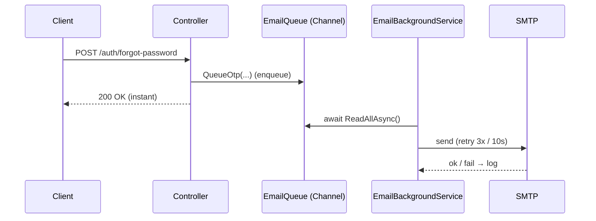

**Create order — Inventory source (FIFO):**
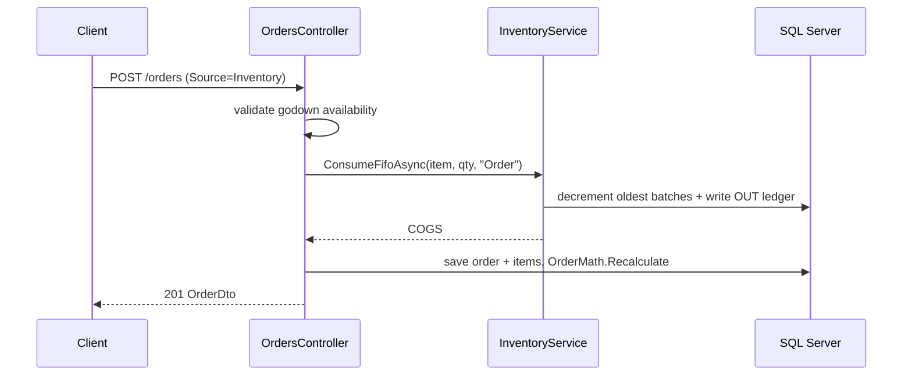

**Record dispatch (godown → truck):**
```mermaid
sequenceDiagram
    participant C as Client
    participant D as DispatchController
    participant Inv as InventoryService
    C->>D: POST /dispatch (truck, items)
    D->>D: validate godown; resolve/auto-register truck; merge same-day
    D->>Inv: ConsumeFifoAsync(item, qty, "Dispatch")
    Inv-->>D: godown ↓ + OUT ledger
    D->>D: DispatchStock ↑, TruckStock ↑
    D-->>C: 201 DispatchDto
```

**Apply customer advance (money‑conserving):**
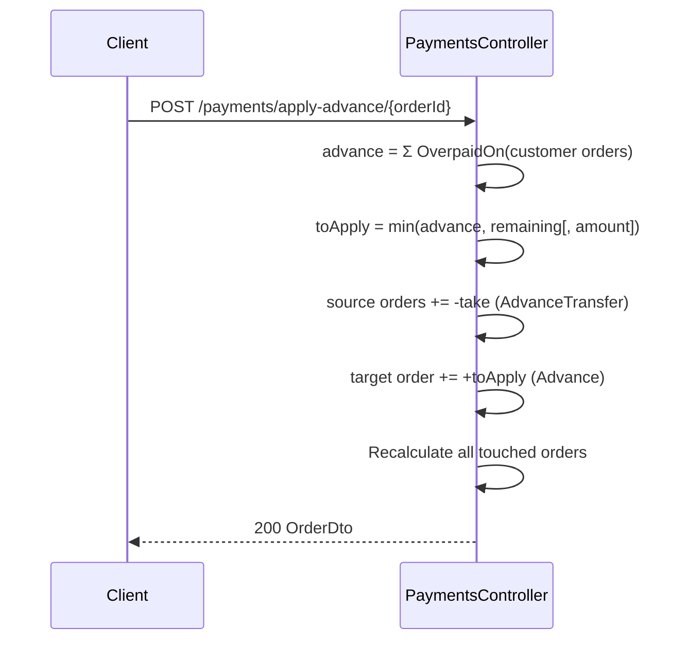

**Fulfil stock request:**
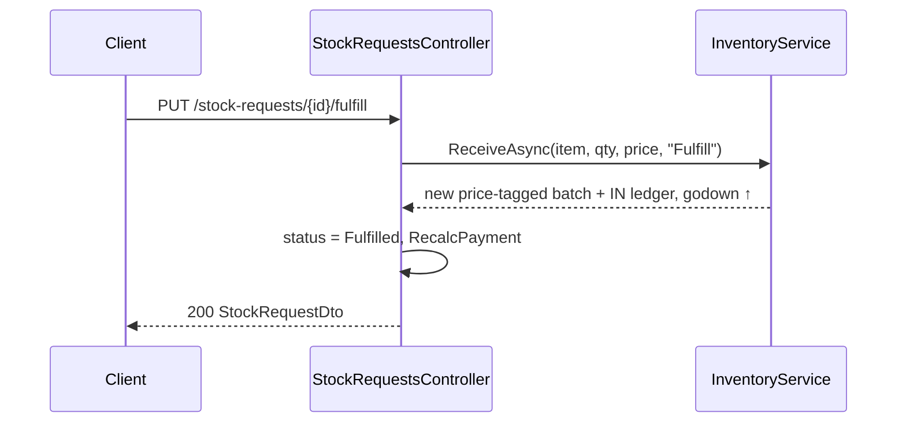

---

# Appendix B — Application Walkthrough (Screenshots)

The screens below illustrate the end-to-end workflow, captured from the running application.

### 1. Login
Secure JWT login (with show/hide password); password recovery via email OTP.

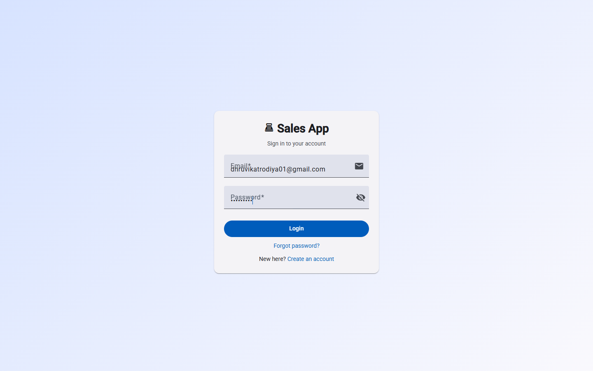

### 2. Dashboard
At-a-glance KPIs — items in catalog, low-stock count, customers, pending orders, total sales and outstanding balance — plus quick actions.

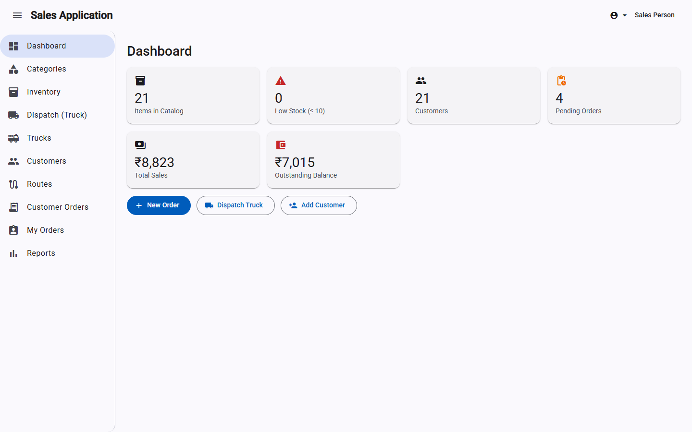

### 3. Categories & Sub-categories
Dual-pane management of the product hierarchy with search, active/inactive filtering and soft-delete.

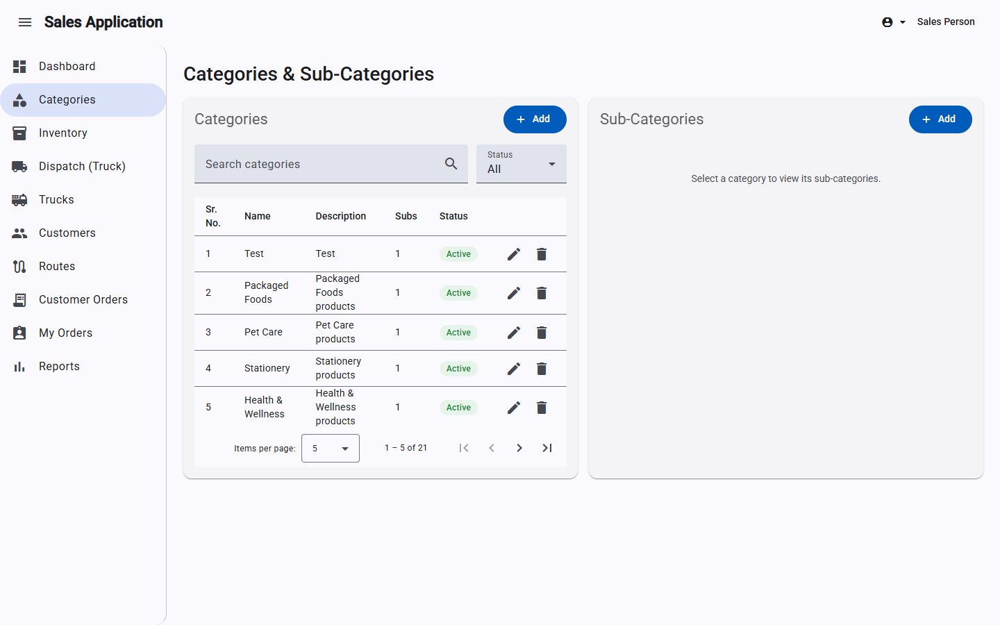

### 4. Inventory
Items with godown and on-truck stock, unit price, SKU, low-stock filter, and per-item price history & movement ledger.

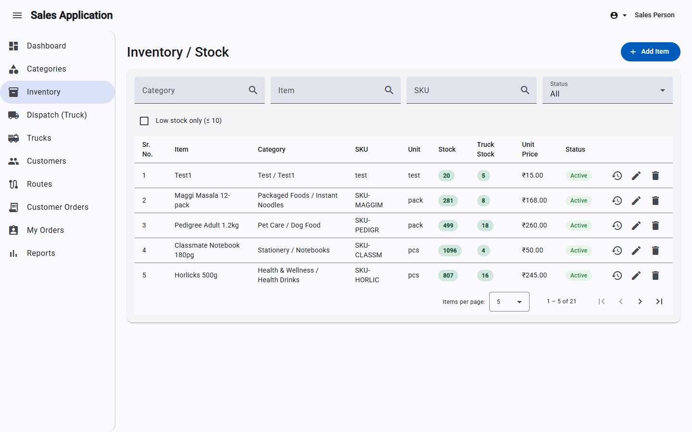

### 5. Dispatch (Truck)
Load godown stock onto a truck — a draft cart, per-truck/day consolidation, stock validation, and reversible history.

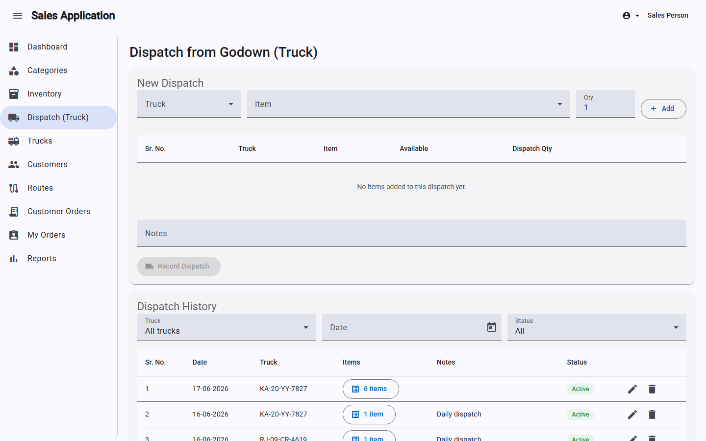

### 6. Customers
Customer directory with route assignment, search, and a 360° detail view (totals, advance, pending vs delivered, orders).

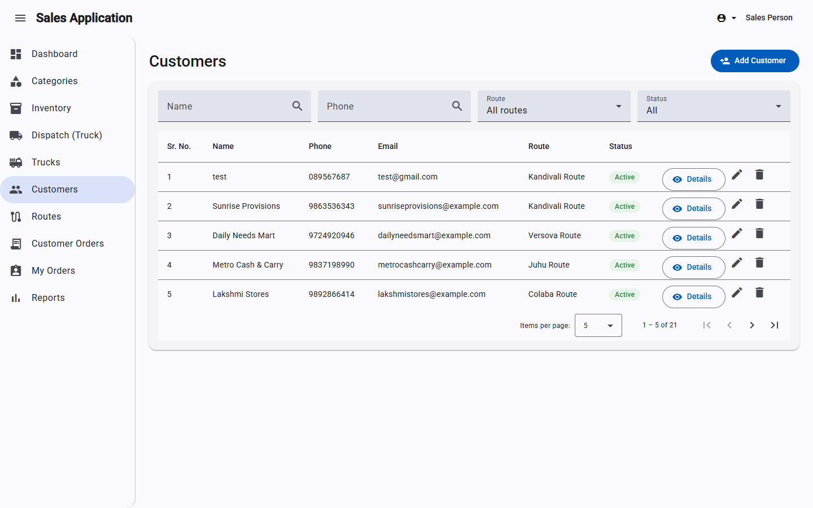

### 7. Customer Orders
Order list with filters (order #, customer, date, delivery status, paid status), status/payment chips, and pagination.

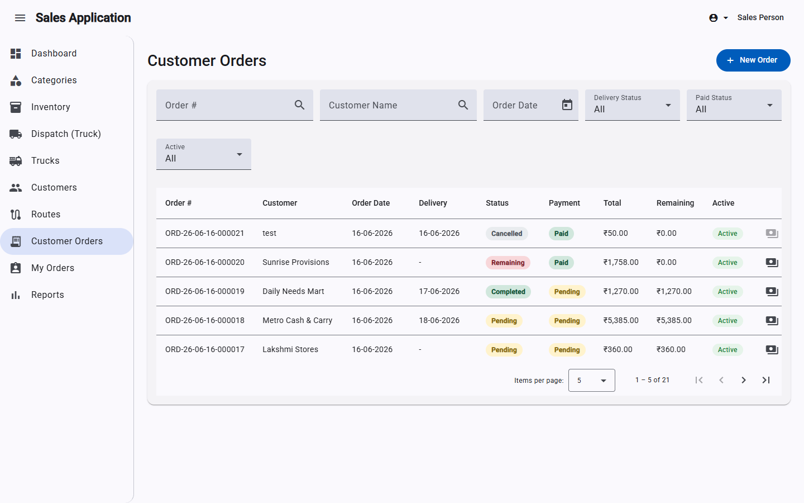

### 8. New Order
Create an order from godown (*Inventory*) or truck (*Dispatch*) stock — customer, delivery date, items, and live total.

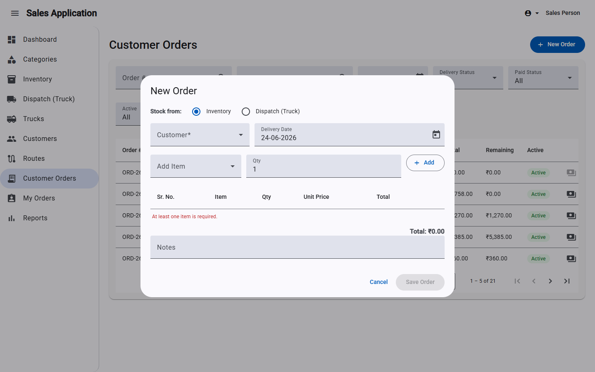

### 9. Reports
Daily / monthly / yearly sales breakdowns and a per-customer pending-vs-delivered & outstanding summary.

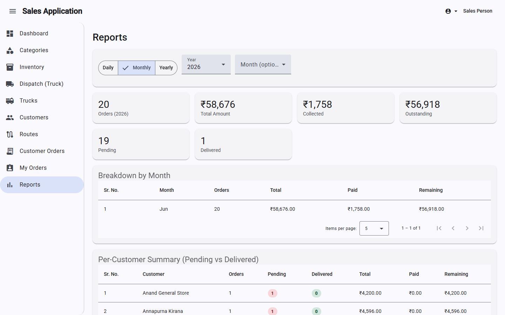

### 10. My Orders (Stock Requests)
The salesperson's own restock requisitions with payment tracking and a fulfil → done workflow.

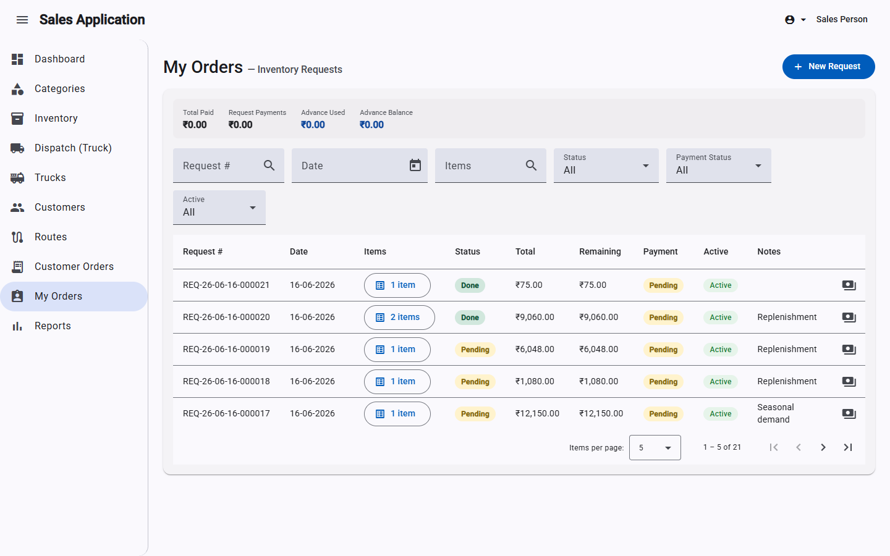

### 11. Trucks
Managed trucks, each with its own per-item stock.

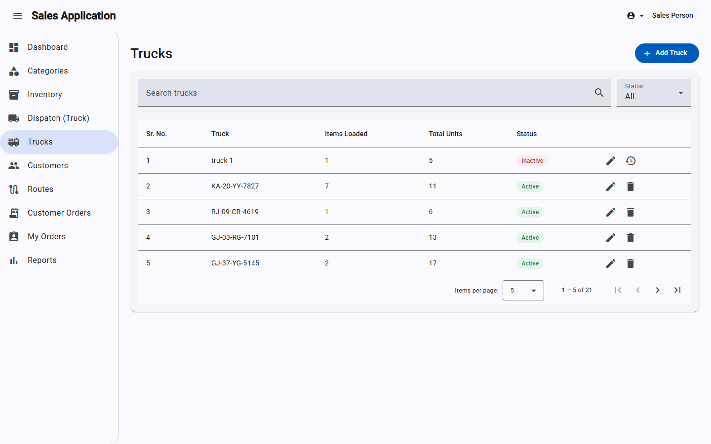

### 12. Routes
Delivery routes that customers are grouped under.

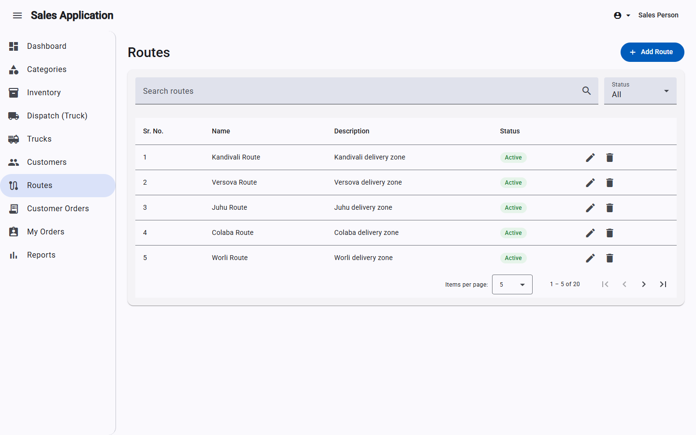

### 13. Profile
Editable profile (name, **email**, phone) with **profile-image upload** and change-password.

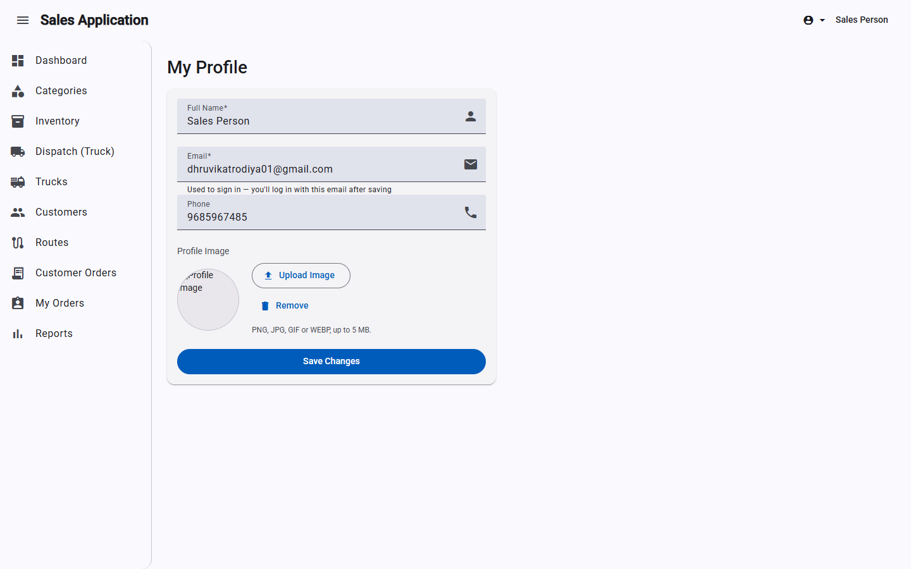

> Screenshots live in `docs/screenshots/` and were captured from the running app
> (`http://localhost:4200`). Re-run the capture after UI changes to refresh them.

